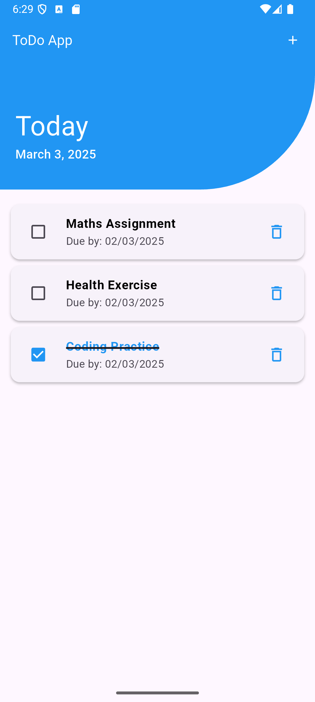
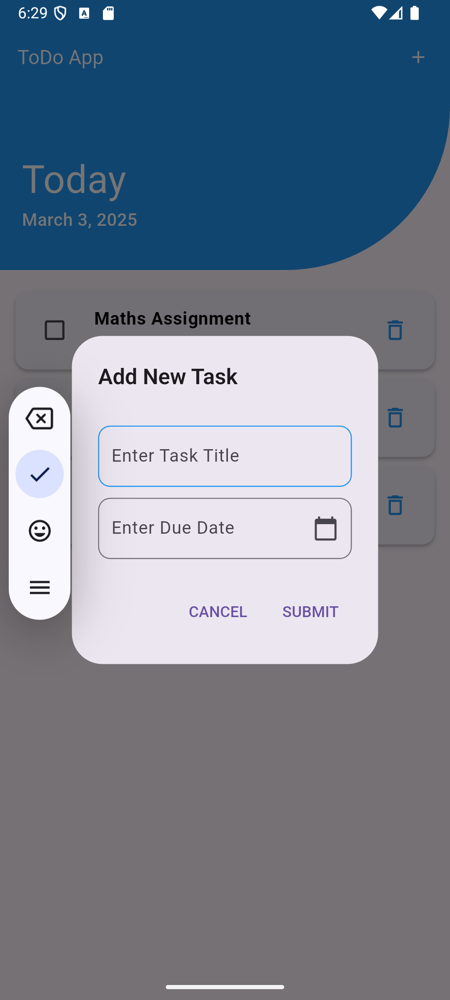

# 📋 Flutter ToDo App

A simple and minimalistic **ToDo application** built using **Flutter**. This app allows users to manage their daily tasks by adding, completing, and deleting tasks with a smooth and intuitive interface.

## 🚀 Features

- ✅ Persistent storage of tasks using **SQLite**.
- 📝 Add new tasks with a **title** and **due date**.
- ✔️ Mark tasks as **Completed** or **Incomplete** with automatic styling updates.
- 📅 Automatically highlights **overdue tasks** in red.
- 🗑️ Delete tasks easily.
- 🎨 Dynamic styling:
  - Completed tasks: **Blue text** with **strikethrough**.
  - Overdue tasks: **Red text**.
  - Incomplete tasks: **Black text**.
- 📦 Modular code structure following best practices.


## 📂 Project Structure

```plaintext
/lib
├── main.dart                    # Main UI and app logic
├── Task.dart                    # Task model class
└── data/
    └── local/
        └── DBHelper.dart        # SQLite database helper
```


## 📱 Screenshots

| Home Screen | Add Task Dialog |
|-------------|-----------------|
|||

## 🛠️ Tech Stack

- Flutter (UI toolkit)
- Dart (Programming Language)
- SQLite (Local database using sqflite)
- intl (Date formatting)
- Material Design (UI components)


## 💡 How it Works

- The app initializes with data fetched from SQLite.
- You can check/uncheck tasks. The UI updates instantly:
- ✔️ Completed tasks move to the bottom with a blue color and strikethrough.
- ❌ Incomplete tasks stay on top with black color and normal text.
- Add a new task using the "+" button in the AppBar.
- Delete any task with the trash icon.
- All tasks are persisted locally using SQLite, so no data is lost on app restart.

## ⚠️ Known Limitations

- No cloud sync or online backup.
- Basic UI without animations.

## 🏗️ Future Improvements

- Add notifications/reminders for due tasks.
- Cloud sync with Firebase.
- Dark mode support.
- Task categorization and priorities.
- Improved animations and transitions.
## 🏃 Getting Started

### Prerequisites:
- Flutter SDK installed
- Compatible IDE (like **Android Studio** or **VSCode**)

### Run the App:
```bash
flutter pub get
flutter run
```

## 📬 Contact
- 📧 Email: pranjalgarg2005@gmail.com
- 💼 LinkedIn: https://www.linkedin.com/in/pranjal-garg-9158a0229/
- 🐙 GitHub: https://github.com/pranjal-garg
